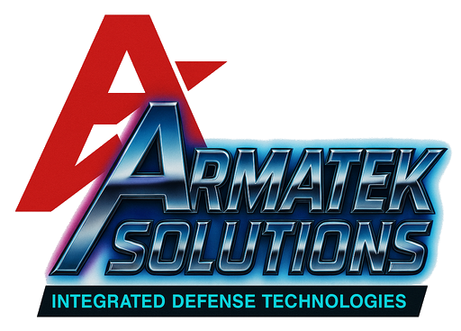

# ArmaTek Solutions: Technologia w służbie przyszłości 🚀

Lider w dziedzinie zaawansowanych technologii, systemów integracyjnych i innowacyjnych rozwiązań sprzętowych.

Od momentu powstania realizujemy wizję przyszłości, w której technologia stanowi fundament wszelkich działań strategicznych i operacyjnych. Nasze produkty projektujemy i testujemy z myślą o maksymalnej **niezawodności**, **wydajności** oraz zgodności z najwyższymi standardami bezpieczeństwa.

   

---

## 💎 Nasza Misja i Filozofia

Nasza firma to synonim doskonałości technicznej, dyscypliny operacyjnej oraz bezkompromisowego podejścia do jakości. W ArmaTek wierzymy, że przyszłość należy do tych, którzy kontrolują technologię — dlatego dostarczamy rozwiązania przygotowane na wyzwania XXI wieku i dalej.

Zaufanie naszych klientów to efekt nieustannego rozwoju, rygorystycznych testów i pełnej transparentności procesów produkcyjnych. Niezależnie od skali przedsięwzięcia — czy to kompleksowe wdrożenia przemysłowe, czy precyzyjne urządzenia specjalistyczne — ArmaTek dostarcza sprzęt, który wyznacza nowe standardy branży.

## ✨ Wartości, które nas napędzają

* **Doskonałość Operacyjna** – Rygorystyczne standardy produkcji i kontroli jakości to dla nas podstawa.
* **Innowacyjność** – Nieustannie rozwijamy nasze portfolio, inwestując w badania i technologie jutra.
* **Zaufanie i Bezpieczeństwo** – Transparentność procesów i niezawodność sprzętu to fundament relacji z klientami.
* **Odpowiedzialność** – Działamy etycznie i z pełnym zaangażowaniem na rzecz zrównoważonego rozwoju.
* **Precyzja i Efektywność** – W każdym aspekcie naszej pracy stawiamy na maksymalizację wydajności i minimalizację ryzyka.

---

W ArmaTek wiemy, że przyszłość to nie miejsce – to stan umysłu. Nasza technologia jest przygotowana, aby sprostać wyzwaniom dzisiejszego świata i tworzyć fundamenty jutra.

➡️ **Odwiedź naszą pełną stronę internetową, aby dowiedzieć się więcej o naszych rozwiązaniach:** [https://www.armatek.ovh/content/4-about-us](https://www.armatek.ovh/content/4-about-us)
